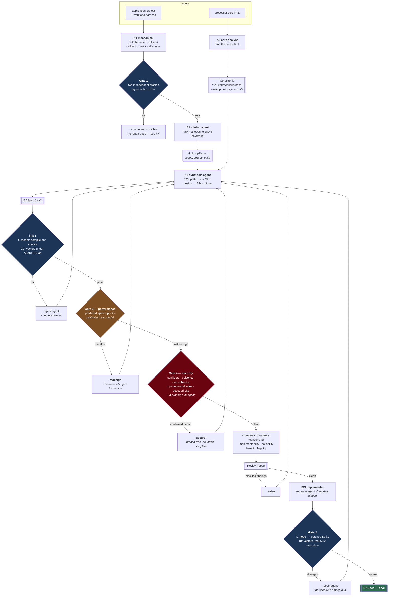

# RED — agent loop architecture

RED turns *one application project + one processor core* into a verified,
architecture-specific RISC-V ISA extension. This document describes the loop as
it now stands: what each agent does, what each gate refuses, and why each piece
exists — every one of them was added because something measurable went wrong
without it.

---

## 1. The loop at a glance



Plain-text form, for terminals:

```
 project ──► A1 profile ×2 ──► Gate 1 (±5%) ──► A1 mining ──► HotLoopReport ─┐
 core ─────► A0 core analyst ────────────────► CoreProfile ─────────────────┤
                                                                            ▼
                                                            ┌────────► A2 synthesis
                                                            │              │
                                     repair / redesign /    │              ▼
                                     revise  (feedback)     │          ISASpec
                                                            │              │
                                                            │   ┌──────────┼───────────┐
                                                            │   ▼          ▼           ▼
                                                            └ link 1    Gate 3   Gate 4 ──► 4 reviewers
                                                              (models)  (speed)  (security)  (concurrent)
                                                                            │
                                                                            ▼
                                                                 ISS implementer (isolated)
                                                                            │
                                                                            ▼
                                                                   Gate 2 (C ⇔ Spike)
                                                                            │
                                                                            ▼
                                                                    ISASpec (final)
```

---

## 2. The agents

| agent | reads | writes | isolation |
|---|---|---|---|
| **A0 core analyst** | the core's RTL, via the sealed source tool | `CoreProfile` | — |
| **A1 mining** | project sources + the mechanical profile | `HotLoopReport` | cannot self-report cycle numbers; the loop merges those from the profile |
| **A2 synthesis** (S2a→S2b→S2c) | `HotLoopReport`, `CoreProfile`, profile, status, notes | `ISASpec` incl. `c_model` | cannot write `spike_model` — the field is dropped |
| **4 reviewers** | the spec + report + core profile, inline | JSON findings | no tools, no state; four independent readings |
| **security reviewer** | the spec incl. every `c_model`, the mechanical security report, the core | probe requests + JSON findings | cannot write the spec at all; its assertions are capped at `major` and cannot fail Gate 4 — only vectors it supplies that actually break a model count |
| **ISS implementer** | the spec **with every `c_model` withheld** | `spike_model` only | its tool serves a redacted spec and accepts nothing else |
| **repair / revise / redesign** | the failing verdict + counterexample | revised `ISASpec` | same agent as A2, different charter |

Two isolation boundaries carry real weight:

- **A2 ↮ ISS implementer.** Gate 2 compares two executable models. It means
  nothing if one author saw the other's work, so `IssTool` serves the spec with
  the C models replaced by `(withheld)` and accepts only `spike_model` back,
  while `DesignerTool.write_spec` silently drops any `spike_model` sent to it.
  The separation is enforced by the tool surface, not by asking politely.
- **Claims ↮ evidence.** The security reviewer is the sharpest case: it is the
  agent best placed to spot a leak and the one least able to prove one. So its
  tool gives it an executor rather than a verdict — `probe_vector` runs the
  instruction on an operand value it chooses, under the sanitizers, and only
  what actually faults is recorded as blocking. The agent's judgement aims the
  machinery; the machinery decides.
- **Agents ↮ ground truth.** Every verdict an agent reads (`read_status`) is
  written by the loop from a gate's output. No agent can assert its own spec
  passed anything; `passes_link1` / `passes_gate2` are reset by the loop before
  the gates run.

---

## 3. The gates

| edge | asks | mechanism | on failure |
|---|---|---|---|
| **Gate 1** | is the profile reproducible? | two independent callgrind runs, ±5% | run marked not converged |
| **link 1** | are the C models executable and total? | compile + 10⁵ corner/random vectors under ASan+UBSan | counterexample → repair (≤3) |
| **Gate 3** | is it actually *faster*? | calibrated cost model vs measured software cost, Amdahl over measured shares | the arithmetic → redesign (≤3) |
| **Gate 4** | is it safe to build into the machine? | sanitizers over adversarial vectors, poisoned output blocks, per-operand instruction counts, decoded encoding bits, taint scan — plus a sub-agent that probes with vectors of its own | confirmed defect → secure (≤2) |
| **review** | is it worth building? | 4 concurrent sub-agents | blocking findings → revise (≤2) |
| **Gate 2** | is the spec unambiguous? | independently written Spike model executes the real encoding on rv32; 10⁵ vectors | divergent vector → repair (≤3) |

A run converges only when **all** of Gate 1, link 1, Gate 3, Gate 4 and Gate 2
pass with no blocking review findings. Gate 4 is additionally re-run, without its
agent, on whatever spec finally ships — the review can revise a design after the
security stage passed it, and a revision made to satisfy a reviewer can put back
exactly what the security gate rejected.

### Gate 3, in detail

```
instruction cycles = FIXED + BEAT × (2 × words) + MAC × mac_ops
```

with `FIXED = 28`, `BEAT = 2`, `MAC = 1` — fitted to the RTL in `eval/`
(`mac96`: 10 words moved → 48 cycles; `add256`: 32 → 92). The software side is
measurement, not modelling: the kernel's cost and call count come from
callgrind, converted at 8.51 cycles per host instruction (measured
298,502,758 cycles / 35,063,482 Ir for one ECDH).

Operand traffic is fixed by `words` and paid every invocation, so the decisive
quantity is **arithmetic per operand word moved**:

| design | words | MACs | cycles | MAC/word | app speedup |
|---|---|---|---|---|---|
| one 32×32 MAC, 64× per call | 5 | 1 | 49 | 0.10 | 1.32× — rejected |
| whole 256×256 multiply | 16 | 64 | 156 | 2.00 | 1.71× — rejected (covers 42%) |
| + whole modular reduction | 16 | 0 | 92 | 0.00 | **9.14× — accepted** |

Each instruction declares `mac_ops`, `replaces`, `invocations` and
`marshal_words`, so the claim is explicit; Gate 3 recomputes it and the RTL
settles it later.

**The declaration is measured, not trusted.** `mac_ops` sets the instruction's
price, which makes it the field worth misreporting — a review round caught a
spec declaring `mac_ops = 0` for what its own `c_model` implemented as a
512-iteration bit-serial reduction. Gate 3 now compiles each model, runs it once
under callgrind, and costs the instruction on what it *executes*:

```
mul256:  declared 64 MAC, measured    758 instructions  ->  declaration stands
modred:  declared  0 MAC, measured 59,991 instructions  ->  repriced 92 -> 7,590 cycles
                                                            (111x claim -> 1.35x)
```

### Gate 4, in detail

Gate 3 asks what an instruction costs. Gate 4 asks what it costs *the machine* —
and it is the one gate whose subject cannot be fixed later. An ISA extension is
built into the silicon at the privilege of whoever issues it; a leak in it is a
leak for the lifetime of the part.

The division of labour is the point of this section. **Only a machine can fail
the gate.** Every finding carries a `confidence`:

| confidence | how the finding was established | can block? |
|---|---|---|
| `confirmed` | a tool observed it — ASan trap, two answers for one input, two instruction counts for two operand values, a memcheck branch on a secret | yes |
| `derived` | decoded or computed from the spec's own declared fields — opcode bits, encoding slots, the cost model's cycle count | yes |
| `heuristic` | taint propagation over the model's source text | no |
| `agent` | the security sub-agent's reading | no |

What actually runs, per instruction:

```
memory.bounds          operand blocks are exactly-sized malloc()s under ASan, so
                       one word of overrun is a trap, not a silent write; UBSan
                       with -fno-sanitize-recover catches the shift by 32, the
                       signed overflow, the out-of-range index
memory.input_mutation  the input block is shadowed and compared after every call
memory.output_residue  every vector runs twice against 0xA5A5A5A5 and 0x5C5C5C5C
                       output blocks — a word the model never writes shows up as
                       a difference instead of hiding behind a zeroed buffer
model.impure           the same two runs catch state carried between invocations
timing.data_dependent  callgrind with --collect-atstart=no and collection toggled
                       inside <ident>_model, once per operand value: the number is
                       the instruction's own work, and two values that produce
                       different counts are a timing channel
timing.secret_branch   the ctgrind technique — the operand block is marked
                       UNDEFINED and memcheck's existing uninitialised-value
                       tracking reports any branch or address that depends on it
timing.taint_scan      taint from in[] to control flow and subscripts (advisory)
encoding.*             the low 7 bits decoded against the four custom opcodes;
                       funct3/funct7 width; two instructions in one slot
model.forbidden_call   a comment- and string-stripped scan for libc, allocation,
                       the clock, the environment, non-local jumps
latency.interrupt_bound the cost model's cycle count against the stall bound: a
                       coprocessor instruction is not interruptible, so its
                       latency is a floor on the machine's interrupt latency
```

The vectors are adversarial before they are random: all-zeros, all-ones, one bit
at every word boundary, carry ripples reaching exactly as far as each word, then
pseudo-random fill.

**Where the sub-agent fits.** Those checks generate inputs from the *shape* of
the operand block. They cannot generate the input that is interesting because of
what the arithmetic *means* — the modulus itself, the value one below the
reduction threshold, the pair whose product is exactly 2³². A language model is
good at exactly that and bad at verdicts, so `red/prompts/security.md` gives it
the hypotheses and takes away the verdict: it reads the spec and the mechanical
report, calls `probe_vector` with operand values it believes are dangerous, and
RED *executes them* under the same sanitizers. A vector that faults becomes a
`confirmed` blocking finding through the same path as everything else. What the
agent merely asserts is capped at `major` by
`red.security.parse_agent_findings` — it reaches the designer as advice and
cannot fail the gate.

That asymmetry is deliberate in both directions. A security checker a model can
talk into rejecting a sound design is not a checker; one that passes an unsafe
design because the model said it looked fine is worse.

**A skipped check is never a passed check.** The report carries `checks_skipped`
with the reason, the gate's one-line detail says how many could not run, the
reviewers are told, and the run summary prints `NOT CHECKED —`. The memory-safety
battery is *required*: a host without a C compiler fails the gate rather than
passing on the static checks alone, because those establish nothing about what a
model does. This was a real bug during development — a memcheck that could not
start (a stripped `ld.so` without debuginfo) was being read as "no leak found".

**What this actually did on the cluster.** Two full runs plus one targeted
experiment on the bundled example:

- Both runs' designs passed Gate 4 on round 1 with all 13 checks running — the
  GCP profile node can run memcheck, so the ctgrind check is live there (the
  aarch64 head cannot, and says so rather than passing).
- The sub-agent read the spec, the core profile and the mechanical report, then
  probed: all-ones through the 256x256 multiply to test carry propagation into
  the top word, an already-reduced input through the reduction, an input chosen
  to force a negative carry. Every probe was *executed* under ASan+UBSan; all
  came back clean, and the agent's remaining claim was recorded as advisory.
- The repair edge was exercised deliberately, because a run that passes never
  tests it: the converged spec's reduction was given a textbook conditional
  final subtraction. Both constant-time checks confirmed it independently
  (`264 vs 165` instructions for two operand values, and memcheck reporting a
  branch on the secret), `secure.md` went to the real designer, and it returned
  the masked-select rewrite — `mask = 0 - cond; acc[i] = (d & mask) | (orig &
  ~mask)` — which passed the re-scan with link 1 still green.

The two constant-time checks are not redundant. A branch whose two arms cost the
same number of instructions is invisible to the instruction-count test and is
caught by ctgrind; a data-dependent *trip count* with no branch memcheck can see
is caught by the counts. Both were verified against models built to defeat the
other.

**The prescribed fix is cheap, and that matters.** A gate whose only remedy is a
redesign would cost the run its Gate 3 result. The finding for a data-dependent
branch names the masked-select rewrite:

```c
uint32_t m = (uint32_t)0 - (uint32_t)(cond);   /* cond is 0 or 1 */
r = (a & m) | (b & ~m);
```

which keeps `words` and `mac_ops` — and therefore the speedup — intact. The
designer's charter carries the same bounds up front, so a design is meant to be
born compliant rather than repaired. Where a security revision *does* change the
model, Gate 3 is re-priced on the revised spec rather than reporting a number for
a design that no longer exists.

---

## 4. Concurrency

Long runs are fine, but nothing should wait on something it does not need:

```mermaid
gantt
    dateFormat X
    axisFormat %s
    section mechanical
    profile run 1        :0, 40
    profile run 2        :0, 40
    section agents
    A1 mining            :40, 190
    A0 core analysis     :40, 190
    A2 synthesis         :190, 420
    reviewer implementability :560, 660
    reviewer callability      :560, 660
    reviewer benefit          :560, 660
    reviewer legality         :560, 660
    section gates
    link 1               :420, 460
    Gate 3               :460, 470
    ISS implementer      :660, 850
    Gate 2               :850, 900
```



- the two Gate-1 profiles are dispatched before either is resolved;
- **A1 mining and A0 core analysis overlap** — one reads the project, the other
  the core;
- the four reviewers are toolless, so all four dispatch in one round trip;
- Gate 2's per-instruction differential tests run on a thread pool.

Tool servers are the other cost: every `ChiaTool` is a separate Ray actor that
rescans the port range as it binds, so the surface is **two servers**
(`DesignerTool`, `IssTool`) rather than one per artifact — that alone removed
~2 minutes of dead time before the first agent turn.

---

## 5. Artifacts

Everything lands in `output/db/<workload>/run_<N>/`:

```
CoreProfile.json        A0 — the target core as read from its RTL
profile.json            A1 — per-function cost and call counts
HotLoopReport.json      A1 — ranked loops, shares, coverage
ISASpec.draft.json      A2 — before verification
perf/round<N>.{json,md} Gate 3 — the cost arithmetic, per round
security/round<N>.{json,md} Gate 4 — every check, what it found, what it
                        could not run, and the sub-agent's probes
security/final.{json,md}   Gate 4 re-run on the spec that actually ships
review/round<N>.{json,md}  the reviewers' findings, per round
gates/                  gate1, gate3, gate4, gate2, chain, and every repair round
ISASpec.json            the deliverable
llm_logs/transcript.log every agent turn, in order
summary.md              the run, in one page
```

Those are per-run and they are disposable — the operator is told to clear
`output/` between batches. What persists is the **knowledge graph**.

### 5.1 The knowledge graph (Neo4j)

The per-run artifacts describe one pass in full and connect nothing across
passes. Nothing tied the instruction being designed to the four earlier attempts
at the same kernel, what the performance gate predicted for each, or which
reviewer objection sank them — so every run rediscovered the same lessons, and
the transcripts show exactly that: successive runs proposing the same
per-iteration instruction and being told again that its operand traffic is
charged on every invocation.

A single Neo4j graph accumulates every run:

```
(:Project)<-[:IN_PROJECT]-(:Workload)-[:HAS_LOOP]->(:HotLoop)
                               ^                        ^
                        [:OF_WORKLOAD]             [:REPLACES]
                               |                        |
     (:Core)<-[:TARGETS]-----(:Run)-[:PRODUCED]->(:Spec)-[:HAS_INSTRUCTION]->(:Instruction)
                               |  \                                         ^        ^
                     [:MINED]  |   \[:EVALUATED]->(:PerfEstimate)-[:SCORES]-'        |
                    (loop_id,  |    \[:REVIEWED]->(:Finding)-[:ABOUT]----------------'
                cycle_share,   |     \[:CHECKED]->(:Gate)                            |
                     calls)    |      \[:SECURITY_CHECKED]->(:SecurityFinding)-------'
                               v          (check, confidence, severity)
                           (:HotLoop)
```

It runs **on the head**, because `red_env.sh up`/`down` creates and destroys the
GCP workers and a graph on one of them would be erased at every teardown. Its
data directory sits outside `output/` for the same reason.

Three decisions carry the design:

- **Hot loops are keyed by function, not by the agent's `loop_id`.** A1 names one
  kernel `uECC_vli_mult::inner_loop`, `::inner` and `::region` across three runs.
  Keying on those scatters one kernel's history over three nodes and defeats the
  point. The function name comes from the profiler, so it is stable; the run's
  own name is kept on the `:MINED` edge.
- **Writes never fail the run.** A design run that died because a database was
  down would be a bad trade. Every write is best-effort, every read degrades to a
  sentence the agent can act on, and a run that ends without a verdict is marked
  `aborted` rather than left `running`.
- **Agents can read it and cannot write it.** Refused twice: a clause check for a
  clear message, and a genuinely read-only transaction, which is the enforcement.
  An agent that could edit the graph could rewrite its own history, and the
  reviewers' objections would stop meaning anything.

`SecurityFinding` is a separate label rather than another `Finding` because the
question a later run asks of it is a different question: not "what did a reviewer
dislike" but "what has been *proven* unsafe here before". Its `confidence`
property is what makes that query answerable, so it is stored verbatim.

The designer consults it before designing, through six tools on its existing
server — `graph_prior_designs`, `graph_prior_findings`, `graph_prior_security`,
`graph_best_design`, `graph_loops`, `graph_query`. The decisive column is
`work_per_word`
(`mac_ops` / operand words moved), which is exactly the quantity §3's Gate 3
shows to be decisive: the per-iteration design that lost scores 0.25, the
whole-kernel one that converged scores 2.00. History is offered as evidence, not
instruction — the charter says this run's profile and core profile win where
they disagree.

Full model, setup and queries: `NEO4J_SETUP.md`.

---

## 6. Why each piece exists

Nothing here is speculative; each was added after a measurement.

| piece | the evidence that forced it |
|---|---|
| **Gate 2's isolation** | agreement between two models is meaningless if one copied the other |
| **link 1's sanitizers** | an out-of-bounds C model passed structural validation |
| **A0 core analyst** | A2 specified memory-operand instructions for a coprocessor interface that cannot address memory, and duplicated a multiplier the core already had |
| **Gate 3** | the RTL evaluation measured a fully verified extension at **0.98× for +74% area** |
| **measuring `mac_ops`** | a spec priced a 512-iteration reduction as a memcpy |
| **the reviewers' ABI calibration** | they blocked the fixed operand ABI itself, which `eval/` had already built and measured — a gate that can never pass is not a gate |
| **exact `replaces` matching** | matching `f::inner_loop` to the function `f` paid an instruction that replaces one iteration for all sixty-four |
| **charging the unreplaced remainder** | an instruction covering part of a kernel left the rest running in software, but the model priced the kernel as if it were gone |
| **Gate 4** | every gate above can pass on an instruction that leaks the key it multiplies: a conditional subtraction in a modular reduction is correct, fast, and a working timing attack |
| **the security agent's inability to block** | a model asked "is this safe?" answers confidently either way; the one thing it can do that a checker cannot is *name an interesting input*, so it gets an executor and not a verdict |
| **requiring the battery to have run** | a memcheck that could not start was being read as "no leak found" — a security report that silently omits what it could not check is worse than none |
| **review adjudication** | independent re-readings never converge: each round was free to invent a new objection, so findings fell but never reached zero |
| **the reviewers** | the gates only ever asked "does it mean what it says?" |
| **feedback to the designer** | findings that reach no one change nothing |
| **turn-failure containment** | a `MaxOutputTokensError` tore down a 17-minute run |

The whole-stack evaluation that produced most of this evidence is in
[`eval/RESULTS.md`](eval/RESULTS.md); it builds the extension as PicoRV32 RTL,
runs a full ECDH exchange on cycle-accurate simulation, and synthesises for area.

---

## 7. A converged run

With all of the above in place, the loop converges. One run, every stage active:

```
Gate 1 (re-profile ±5%)   PASS   8,882,791,695 vs 8,882,710,511 cycles (0.00%)
A0                        PicoRV32 RV32I/IC/IM/IMC, PCPI cannot address memory
A1 coverage               91.58%  (80% target)
Gate 3 round 1            1.64x over 43% of cycles   -> rejected (Amdahl)
Gate 3 round 2            0.96x over 92% of cycles   -> rejected (a slowdown)
Gate 3 round 3            8.33x over 92% of cycles   -> PASS
review round 1            4 findings, 0 blocking
Gate 2 (C model vs Spike) PASS   2/2 instructions, 10⁵ random + corner vectors
result                    converged (A1+A2)          A2 rounds: 3
```

The extension it settled on:

| instruction | words | what it replaces |
|---|---|---|
| `vlimult` | 16 | the whole 256×256→512 multiply (`uECC_vli_mult`, 43% of cycles) |
| `mmod256` | 16 | the whole 512→256 reduction mod the secp256r1 prime (48%) |

Both are *whole-kernel* instructions with one invocation per call — the shape
Gate 3 exists to force. Gate 3's third round is the loop finding it: the second
round was measurably *worse* than the first, the arithmetic said so, and the
designer changed course.

## 8. Across runs

The designer's choices vary run to run; the gates' verdicts do not. Sampling
consecutive runs on the bundled example:

| run | Gate 3 rounds | final prediction | blocking findings | outcome |
|---|---|---|---|---|
| a | 1 | 9.42× over 92% | 8 → (budget) | not converged |
| b | 2 (0.91× → 15.52×) | 15.52× over 98% | 5 → 3 | not converged |
| c | 2 (1.80× → 9.66×) | 9.66× over 92% | 8 → … | not converged |
| d | 2 (0.84× → 7.48×) | 7.48× over 92% | 2 → 2 (oscillating) | not converged |
| **e** | **3 (1.64× → 0.96× → 8.33×)** | **8.33× over 92%** | **0** | **converged** |

Runs a–d are before the convergence fixes of §9; run e is after. Gate 3 lands
between 7× and 15.5× predicted whole-application speedup in every case, against
the **0.98× that was actually measured** on the extension that motivated this
work — which is the difference the performance gate makes.

## 9. Convergence

A run converges only when Gate 1, link 1, Gate 3 and Gate 2 all pass **and** no
blocking review findings remain. Early runs never reached that: the reviewers'
findings fell every round (10→4, 8→1, 9→5→3) but never hit zero. Three causes,
all now fixed, and each was a defect rather than a reason to relax the bar:

1. **The reviewers redrew the spec from scratch each round.** Nothing showed a
   reviewer what it had said before, so a resolved finding could be replaced by
   a fresh one indefinitely. Each reviewer now receives its own previous
   findings and must adjudicate them — resolved, or repeated verbatim — before
   raising anything new.
2. **Gate 3 could be overcredited, which produced real findings the designer
   then had to fix under review.** An instruction naming `f::inner_loop` was
   matched to the whole function `f` and paid for sixty-four iterations of work
   it did once. `replaces` is now rejected at the tool boundary unless it names
   a mined loop exactly, the C model's measured work is compared against the
   work claimed, and whatever an instruction does *not* replace is still charged
   to the kernel.
3. **Two rounds was not enough room** for a designer to fix eight or ten real
   defects. Both budgets are four (`RED_REVIEW_ROUNDS`, `RED_PERF_ROUNDS`).
   Gate 3 also **keeps the best design it has seen**: a redesign is not
   guaranteed to improve on the last one — one run went 1.64×, then 0.96×, then
   8.33× — so a regression is reported to the designer as a regression, and if
   the budget runs out the loop hands on the best spec rather than the most
   recent.
4. **The reviewers blocked on things the machinery already enforces.** Two
   consecutive rounds blocked on whether `mac_ops` was 64 or 72 — a 12%
   discrepancy that Gate 3 *measures and reprices automatically*, and which the
   two reviewers disagreed about, so the designer oscillated between the values
   they each demanded. The reviewers are now told exactly what is enforced
   deterministically (`mac_ops` pricing, `replaces` validity, model totality,
   encoding collisions, spec ambiguity) and that their value is the judgement
   none of it can make: does the instruction fit the machine, can the
   application call it, is it worth its area.

That last one is the division of labour the whole architecture rests on. A
mechanical check that is deterministic and complete should never be duplicated
by an agent's opinion — the agent adds noise and can veto on a technicality the
gate has already priced correctly.

The bar itself is unchanged: a spec with an unresolved blocking finding is not
converged, and the run says so.

### 9.1 Four more, found only by running on the cluster

The four fixes above were developed against a locally-hosted loop, where a run
converged. Moving the same code to the cluster produced **three consecutive
non-converged runs, all reporting `1.00x over 0% of cycles` in every Gate 3
round** — a signature no design can produce. Each cause was environmental in
origin and a code defect in substance, and none was reachable without running
distributed:

5. **Call counts came from threshold-filtered text.** RED parsed
   `callgrind_annotate`, which prints a callee row only above a cost cutoff.
   Both micro-ecc kernels are reached from many individually-cold call sites, so
   on the profiling node's valgrind 3.19 neither had a callee row at all and
   both call counts read as zero. Gate 3 prices software *per call*, so a zero
   there silently disables every benefit it could credit. It worked on the
   development host only because valgrind 3.27 happened to print enough rows.
   RED now reads the raw callgrind file (`red/callgrind.py`), which records
   every `calls=` event exactly at every version; the parse reproduces the
   file's own `summary:` line to the instruction, and matches a self-counting
   program exactly.
6. **The report had two sources of truth.** `write_report` was reachable from
   A2, and A2 used it — rewriting A1's measured call counts to values that made
   its own instructions look profitable — while Gate 3 went on scoring against
   the untouched in-memory copy. The designer was acting on feedback derived
   from its own edit, which no amount of budget can converge. A1's report is
   now frozen after Gate 1 and the tool rejects edits to it.
7. **A profiling failure was reported as a bad design.** Missing call counts
   surfaced as "1.00×", so the loop spent its entire redesign budget asking the
   designer to fix something it could not see. Gate 3 now separates
   *unpriceable* from *unprofitable* and escalates immediately with a message
   naming the profiler.
8. **`_IR_PER_OP` was a hard-coded compiler property.** Gate 3 compares a
   model's measured instruction count against its declared `mac_ops`; the
   conversion was fixed at 8.0 Ir per MAC. The real figure is 14.7 on the
   development host and 16.1 on the profiling node, so honest declarations were
   being rejected as understatements and their instructions overpriced. It is
   now calibrated on whichever machine is measuring, against a reference
   multiply of known MAC count.

Two infrastructure faults were fixed alongside them, because both corrupt
results rather than merely inconveniencing the operator:

- **A lost worker hung the driver indefinitely.** The workers' reverse SSH
  tunnels dropped mid-run, the `llm` resource left the scheduler, and `ray.get`
  on the next turn blocked for **nine hours** while the autoscaler logged "No
  available node types can fulfill resource request" twice a minute and the
  instances billed. A plain timeout would be the wrong fix — callgrind over a
  whole ECDH exchange legitimately runs ~20 minutes — so `red.loop._await`
  polls: it re-checks that the resource the task needs is still in the cluster,
  waits as long as necessary while it is, and fails at once with an actionable
  message when it is gone.
- **Recycled IPs poisoned `known_hosts`.** GCP reuses external addresses within
  a project, so the address that was the database node returns as the llm node
  with a new host key; ssh then refuses, chia's `echo ok` setup probe times out,
  and that node silently drops out of the bring-up. `scripts/red_env.sh` now
  purges the cluster's addresses from `known_hosts` on both `up` and `down`, and
  `up` recovers the orphaned-instances-with-no-live-head state instead of
  leaving nodes billing that nothing can reach.

The lesson worth keeping: a single-host run cannot validate a distributed loop.
Every one of these eight defects was invisible to the tests and to a local run,
and the three that mattered most were *silent* — they degraded a measurement to
zero rather than raising, and the loop dutifully blamed the design.

## 10. Known limits

- **Gate 1 has no repair edge.** A failing Gate 1 is recorded, not fixed. In
  practice callgrind on a fixed binary reproduces at 0.00% drift.
- **Gate 3 is a model, not a measurement.** It predicts kernel speedup within
  ~15% of the RTL on the cases `eval/` covers — enough to separate a 5× design
  from a 0.98× one, which is what a gate needs. The RTL is the arbiter.
- **A3/A4/A5 are not loop nodes.** The RTL, the compiler support and the
  end-to-end run in `eval/` are hand-built for one ISASpec. Nothing generates a
  datapath from a C model.
- **RED's operand ABI is fixed** (`rs1` = &input block, `rs2` = &output block).
  It is what lets any instruction be harnessed mechanically, and it is also the
  constraint that makes fine-grained instructions unprofitable.
